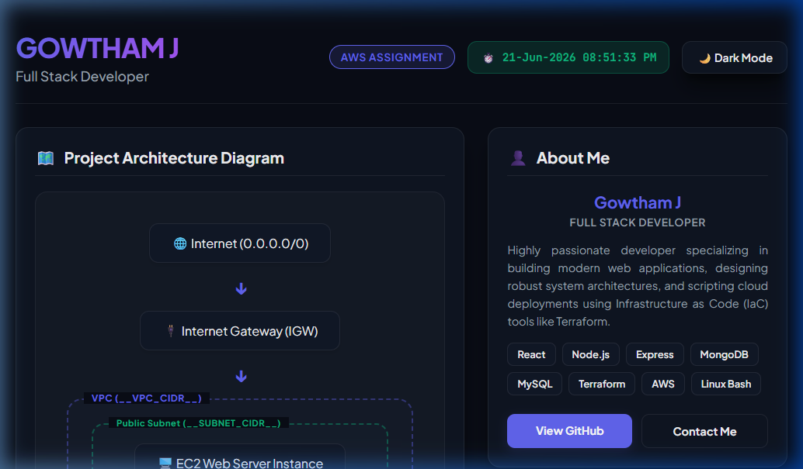
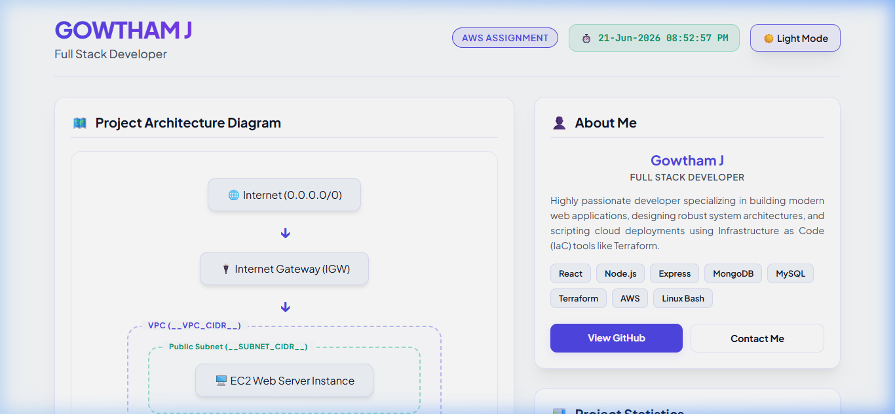
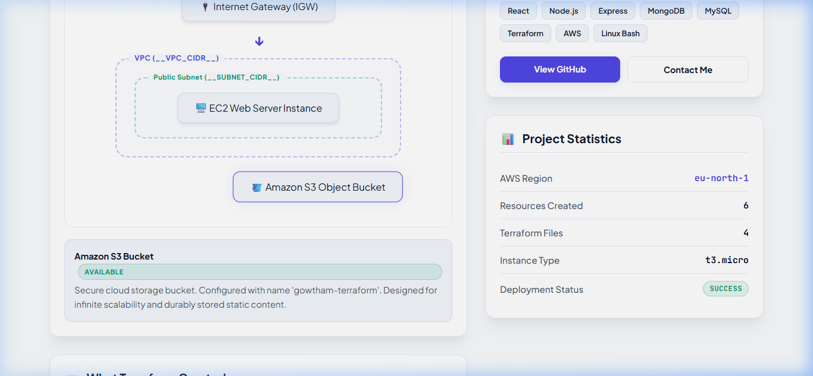

# Terraform AWS — Full Project

> **Learning goal:** Provision a complete, internet-facing AWS environment — VPC, EC2 web server, Security Group, Internet Gateway, S3 — using Terraform and Infrastructure-as-Code best practices.

---

## Project Overview

This project uses **Terraform** to automatically provision a set of AWS resources that together form a fully functional web server deployment. No clicking in the AWS Console — every resource is defined in code, version-controlled, and reproducible.

- **AWS Region:** `eu-north-1` (Stockholm, Sweden)
- **Terraform version:** ≥ 1.3.0
- **AWS Provider version:** `~> 5.0`
- **Web server:** Apache (httpd) on Amazon Linux 2023, serving "Hello Terraform"

---

## Deployed Showcase Screenshots

### 1. Animated Deployment Terminal
When the page is first loaded, a retro terminal simulator types out the HCL initialization and resource creation steps:


### 2. Full-Stack Showcase Dashboard
A dashboard displaying real-time values, system statistics, Gowtham J's developer bio/skills, and a dark/light mode toggle:


### 3. Interactive Architecture Diagram
A visual flowchart displaying the relationship of AWS components. Clicking any resource node displays its purpose and configuration details:


---

## Architecture Diagram (Text Format)

```
Internet
    │
    │  HTTP :80  /  SSH :22
    ▼
┌──────────────────────────────────────────────────────┐
│  Internet Gateway (IGW)                              │
│  — the door between the VPC and the public internet  │
└─────────────────────┬────────────────────────────────┘
                      │
┌─────────────────────▼────────────────────────────────┐
│  VPC  (10.0.0.0/16)                                  │
│                                                      │
│  ┌─────────────────────────────────────────────────┐ │
│  │  Route Table                                    │ │
│  │  0.0.0.0/0  →  IGW  (internet traffic)          │ │
│  │  10.0.0.0/16 → local (internal traffic)         │ │
│  └───────────────────┬─────────────────────────────┘ │
│                      │ (associated via RT Association)│
│  ┌───────────────────▼─────────────────────────────┐ │
│  │  Public Subnet  (10.0.1.0/24)  eu-north-1a      │ │
│  │                                                  │ │
│  │  ┌──────────────────────────────────────────┐   │ │
│  │  │  EC2 Instance  (t3.micro)                │   │ │
│  │  │  Amazon Linux 2023                       │   │ │
│  │  │  Public IP: <assigned at launch>         │   │ │
│  │  │  ┌──────────────────────────────────┐   │   │ │
│  │  │  │  Security Group                  │   │   │ │
│  │  │  │  Ingress TCP :22  from my IP     │   │   │ │
│  │  │  │  Ingress TCP :80  from 0.0.0.0/0 │   │   │ │
│  │  │  │  Egress  all  to  0.0.0.0/0      │   │   │ │
│  │  │  └──────────────────────────────────┘   │   │ │
│  │  │  Apache httpd → "Hello Terraform"        │   │ │
│  │  └──────────────────────────────────────────┘   │ │
│  └─────────────────────────────────────────────────┘ │
│                                                      │
│  S3 Bucket (object storage, separate from VPC)       │
└──────────────────────────────────────────────────────┘
```

**Traffic flow to reach the web page:**
1. Browser sends `GET http://<public-ip>/` → hits **Internet Gateway**
2. IGW routes the packet into the **VPC**
3. VPC consults the **Route Table** → matched by `0.0.0.0/0 → IGW`
4. Packet arrives at the **EC2 instance** in the public subnet
5. **Security Group** checks: port 80 from 0.0.0.0/0 → allowed
6. Apache serves `index.html` → dynamic dashboard appears

---

## Project Structure

```
terraform-assignment/
├── main.tf                         # All resource definitions
├── variables.tf                    # Input variable declarations
├── outputs.tf                      # Values printed after apply
├── terraform.tfvars                # Your actual variable values (git-ignored)
├── terraform.tfvars.example        # Template — safe to commit
├── .gitignore                      # Files excluded from version control
├── .github/
│   └── workflows/
│       └── terraform.yml           # GitHub Actions CI workflow
└── README.md                       # This file
```

---

## Prerequisites

| Tool | Version | Install |
|---|---|---|
| [Terraform](https://developer.hashicorp.com/terraform/downloads) | ≥ 1.3.0 | `winget install Hashicorp.Terraform` |
| [AWS CLI](https://docs.aws.amazon.com/cli/latest/userguide/install-cliv2.html) | v2 | [Download](https://aws.amazon.com/cli/) |
| AWS Account | — | [Sign up](https://aws.amazon.com/free/) |

Your AWS user/role needs permissions for: **EC2, VPC, S3, IAM (read)**.

---

## AWS Authentication

Terraform reads your credentials from the standard AWS CLI config. Set them up once:

```bash
aws configure
# Prompts:
#   AWS Access Key ID     → paste your key
#   AWS Secret Access Key → paste your secret
#   Default region        → eu-north-1
#   Output format         → json
```

Alternatively, export environment variables (useful for CI):

```bash
export AWS_ACCESS_KEY_ID="AKIA..."
export AWS_SECRET_ACCESS_KEY="..."
export AWS_DEFAULT_REGION="eu-north-1"
```

> Warning: Never hard-code credentials in `.tf` files or commit them to Git.

---

## Before Running: Set Your IP

1. Find your public IP:
   ```bash
   curl https://checkip.amazonaws.com
   # e.g. outputs: 203.0.113.5
   ```
2. Edit `terraform.tfvars` and replace the placeholder:
   ```hcl
   my_ip = "203.0.113.5/32"   # your real IP + /32
   ```

---

## Terraform Commands

```bash
# 1. Download the AWS provider plugin (one-time per project)
terraform init

# 2. Check for syntax and formatting errors (no AWS calls)
terraform validate
terraform fmt -check

# 3. Preview what will be created / changed / destroyed
terraform plan

# 4. Create all resources on AWS (type "yes" when prompted)
terraform apply

# 5. Show outputs again without applying
terraform output

# 6. Destroy ALL managed resources when done (saves costs)
terraform destroy
```

---

## Resources Created

| # | Type | Terraform Name | Description |
|---|---|---|---|
| 1 | `aws_s3_bucket` | `main` | Object storage bucket |
| 2 | `aws_vpc` | `main` | Isolated private network (10.0.0.0/16) |
| 3 | `aws_subnet` | `public` | Public sub-network (10.0.1.0/24) |
| 4 | `aws_internet_gateway` | `main` | VPC-internet door |
| 5 | `aws_route_table` | `public` | Routing rules: 0.0.0.0/0 → IGW |
| 6 | `aws_route_table_association` | `public` | Links subnet to route table |
| 7 | `aws_security_group` | `web` | Firewall: SSH from my IP, HTTP from all |
| 8 | `aws_instance` | `web` | t3.micro EC2 running Apache |

---

## Expected Outputs After terraform apply

```
Apply complete! Resources: 8 added, 0 changed, 0 destroyed.

Outputs:

bucket_name          = "gowtham-terraform"
ec2_instance_id      = "i-068e7cbd9fb2e52f0"
ec2_public_ip        = "16.16.213.54"
internet_gateway_id  = "igw-02c6ace6c7fdc40e8"
security_group_id    = "sg-0d452d3a0419a8561"
subnet_id            = "subnet-0307e14baeedda526"
vpc_id               = "vpc-04bf415eae71c996c"
```

### Open the Web Page

After apply, copy the `ec2_public_ip` value and open it in your browser:

```
http://16.16.213.54
```

> Wait 1–2 minutes after `terraform apply` completes. The EC2 instance needs time to boot and run the bootstrap script (install Apache). If you get a timeout, wait a moment and refresh.

---

## AI Usage Declaration

This project was developed with the assistance of **AI coding tools** (Google DeepMind Antigravity / Claude Sonnet) for:
- correcting the errors while writing terraform code
- Writing explanatory comments and documentation
- Structuring the README and architecture diagram

---

## Terraform Commands Reference

| Command | Purpose |
|---|---|
| `terraform init` | Initialize working directory + download providers |
| `terraform validate` | Validate HCL syntax and references |
| `terraform fmt` | Auto-format all `.tf` files |
| `terraform fmt -check` | Check formatting without changing files (CI) |
| `terraform plan` | Preview changes before applying |
| `terraform apply` | Apply changes to AWS |
| `terraform output` | Show outputs without re-applying |
| `terraform destroy` | Remove all managed resources |
| `terraform state list` | List all resources in state file |
